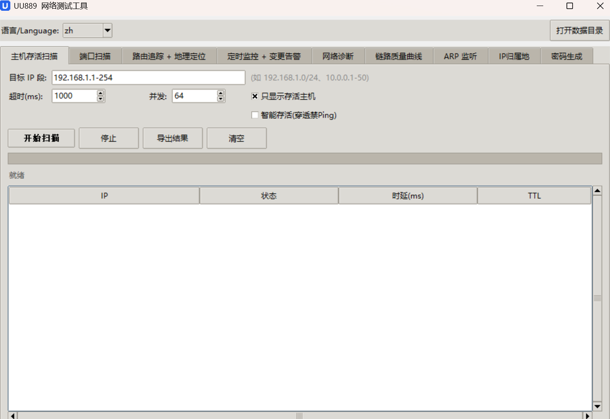
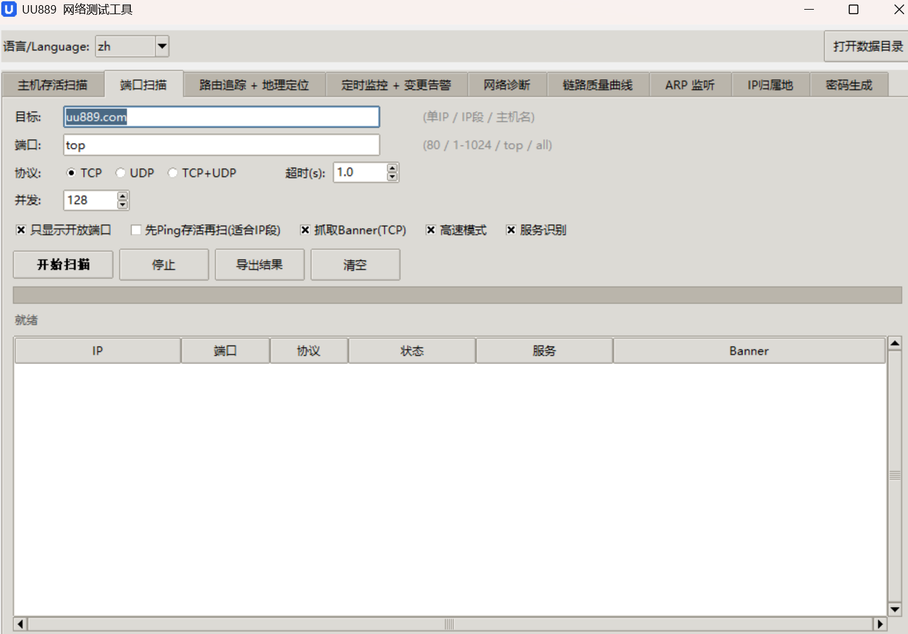
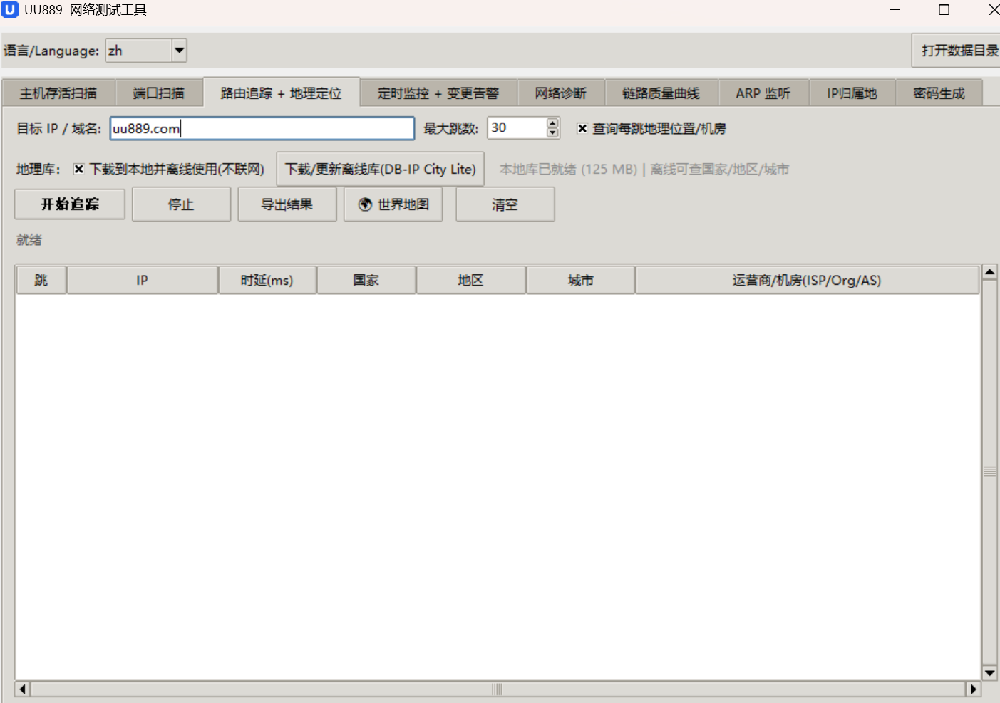
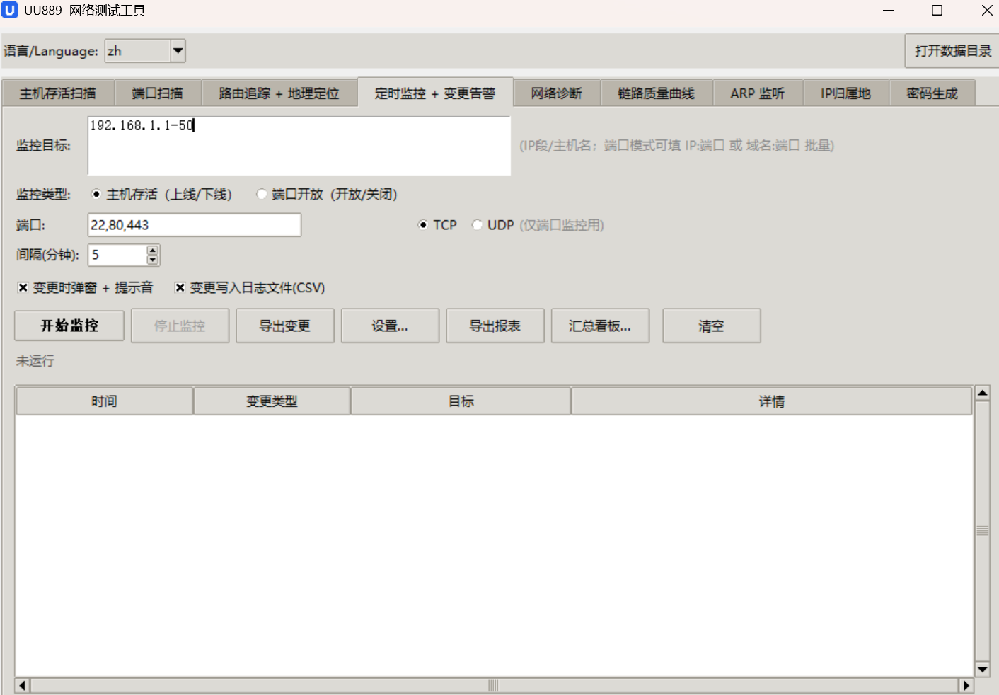
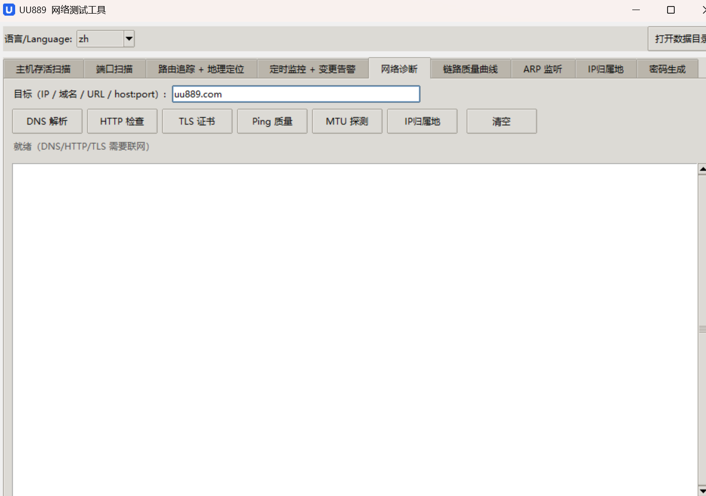
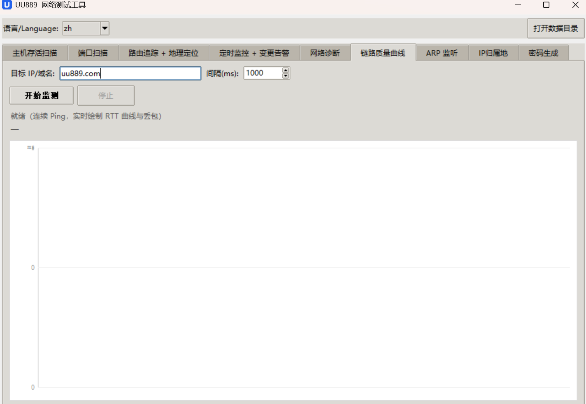
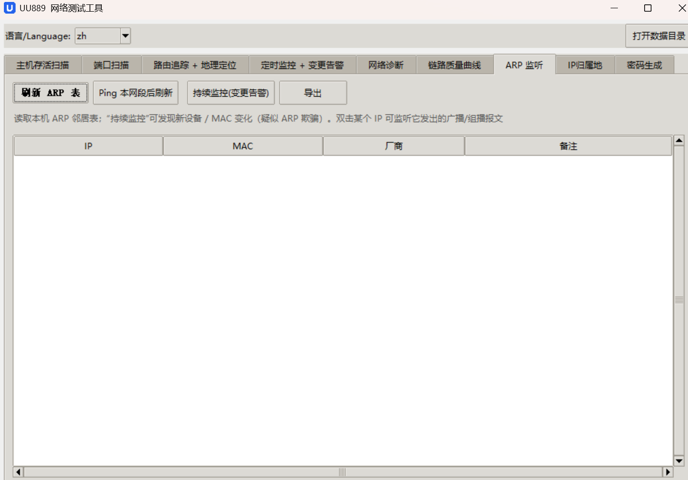
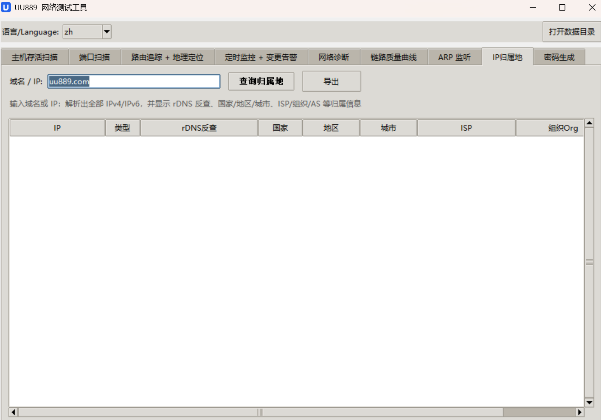
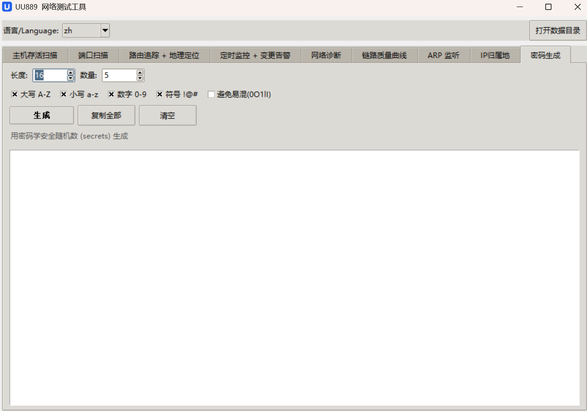

<div align="center">


# UU889 NetProbe

**A zero-dependency, cross-platform, single-file desktop network toolbox**

Host discovery · Port scanning · Traceroute with geolocation · Scheduled monitoring & alerts · Diagnostics · ARP analysis · Offline GeoIP

[](https://uu889.com/)
[](https://github.com/uu889/NetProbe/releases/latest)
[](https://www.python.org/)
[]()
[]()
[](#license--credits)

**🌐 Website: [uu889.com](https://uu889.com/)** ｜ [English](README.en.md) · [中文](README.md)

</div>

> **UU889** packs the small tools you reach for during everyday network troubleshooting into a single `net_probe.py`: it ships both a ready-to-use **GUI** and a scriptable **command line**.
> It is written **entirely with the Python standard library — no `pip install` required** — and can be packaged into a standalone Windows `.exe` in one command.

---

## Table of Contents

- [Highlights](#highlights)
- [Features](#features)
- [Screenshots](#screenshots)
- [Quick Start](#quick-start)
- [Graphical Interface](#graphical-interface)
- [Command-Line Usage](#command-line-usage)
- [Building a Windows .exe (with the custom icon)](#building-a-windows-exe-with-the-custom-icon)
- [Offline Geo Database](#offline-geo-database)
- [How It Works](#how-it-works)
- [Data & Config Locations](#data--config-locations)
- [Internationalization](#internationalization)
- [Compliance & Disclaimer](#compliance--disclaimer)
- [License & Credits](#license--credits)

---

## Highlights

- 🧰 **One file, done** — every feature lives in a single `net_probe.py`; copy it and run. Easy to audit and distribute.
- 🪶 **Zero third-party dependencies** — standard library only (including Tkinter); even the offline-GeoIP `.mmdb` reader is written from scratch with the stdlib.
- 🖥️ **GUI + CLI** — the same code base: click through the interface, or pipe `--json` into scripts / CI.
- 🌍 **Cross-platform** — Windows / macOS / Linux, auto-adapting to each system's `ping` / `tracert` / `traceroute` / `arp`.
- 🔒 **Compliance-first** — built-in authorization allowlist + audit log; **no password brute-forcing** — exposed high-risk services are only flagged defensively.
- 📦 **One-command .exe** — ships an original hand-drawn "U" icon (generated purely in code, no copyright risk); target machines don't need Python.

---

## Features

| Module | What it does |
|---|---|
| **Host Discovery** | Batch-ping an IP range (real ICMP, no root), showing RTT / TTL; adjustable concurrency |
| **Port Scan** | TCP connect scan + UDP protocol probes; service detection, banner grabbing, **high-risk ports highlighted**; a high-speed `selectors` engine; **raw-socket SYN half-open** when run as root (auto-falls back without it) |
| **Traceroute + Geo** | Per-hop traceroute annotated with country/region/city and ISP/Org/AS; a **Leaflet world map** visualization; geo source can be **online or a one-click offline database** |
| **Monitoring + Alerts** | Periodically scan host liveness / port state and alert on change; multi-line targets with mixed `host:port`; **email / webhooks (Slack, Discord, DingTalk, WeCom, Feishu)**; SQLite storage, HTML report + trend chart, PDF export, multi-device dashboard |
| **Diagnostics** | DNS forward/reverse, HTTP(S) check, TLS certificate check, ping quality (loss/jitter), path MTU, IP info; full **IPv6** support |
| **Link-Quality Curve** | Continuously measure a target and plot a loss/latency curve (inline SVG, viewable offline) |
| **ARP Monitor** | Read/actively populate the local ARP neighbor table (IP↔MAC + vendor lookup); continuous monitoring detects **new devices / MAC changes (possible ARP spoofing)**; **double-click an IP to listen to its broadcast/multicast traffic** (NetBIOS/mDNS/SSDP/LLMNR/DHCP…) |
| **IP Info** | Domain → all IPv4+IPv6 addresses, reverse DNS, country/region/city, ISP/Org/AS; tabular, exportable |
| **Password Generator** | Cryptographically secure randomness via `secrets`, configurable length/charset, with a strength estimate |
| **HTTP API / Web Panel** | The `serve` subcommand runs a resident JSON API + a simple web panel for integration |

---

## Screenshots

<div align="center">

| Host Discovery | Port Scan |
|:--:|:--:|
|  |  |
| **Traceroute + Geo** | **Monitoring + Alerts** |
|  |  |
| **Diagnostics** | **Link-Quality Curve** |
|  |  |
| **ARP Monitor** | **IP Info** |
|  |  |
| **Password Generator** | |
|  | |

</div>

---

## Quick Start

**End users (Windows):** grab `UU889-NetProbe.exe` from the **[latest Release](https://github.com/uu889/NetProbe/releases/latest)** — double-click to run, **no Python required**.

**From source / development:** Python **3.8+** (official Windows / macOS installers include Tkinter).
> On Linux without Tkinter: `sudo apt install python3-tk` (Debian/Ubuntu) or `sudo yum install python3-tkinter` (CentOS/RHEL).

```bash
# Clone, or just download net_probe.py
git clone https://github.com/uu889/NetProbe.git
cd NetProbe

# Launch the GUI (double-clicking net_probe.py also works)
python net_probe.py

# Or use the CLI directly, e.g. sweep a subnet for live hosts
python net_probe.py ping 192.168.1.0/24
```

No `pip install`, no virtualenv.

---

## Graphical Interface

The app opens a tabbed window; the top bar switches the **UI language** and opens the **data directory**:

```
Host Discovery │ Port Scan │ Traceroute + Geo │ Monitoring + Alerts │ Diagnostics
Link Quality │ ARP Monitor │ IP Info │ Password Generator
```

- **Port Scan** — "show open only / grab banner / fast mode / service detection" are on by default; open high-risk ports (RDP/SMB/Redis/databases/Docker API, etc.) are highlighted with a risk note.
- **Traceroute** — enable "resolve per-hop geolocation" to annotate each hop; click "🌍 World Map" to open the path in your browser; geo source toggles between online and offline.
- **Monitoring** — the target box is multi-line and resizable; **a line in `host:port` form monitors that port, otherwise the "Ports" field is used** — and if any line is `host:port`, port-monitoring mode is selected automatically.
- **ARP Monitor** — double-click any IP in the list to open a window that listens live to the broadcast/multicast packets it sends.

> 💡 To add screenshots to this README, drop images under `docs/` and reference them here, e.g.
> ``

---

## Command-Line Usage

Every subcommand supports `--json` for machine-readable output.

```bash
python net_probe.py ping 192.168.1.0/24                 # host-discovery sweep
python net_probe.py scan 10.0.0.1 --ports 1-1024        # port scan (TCP/UDP)
python net_probe.py trace 8.8.8.8                        # traceroute + geolocation
python net_probe.py dns example.com                      # DNS forward/reverse
python net_probe.py http https://example.com             # HTTP(S) check
python net_probe.py tls example.com --port 443           # TLS certificate check
python net_probe.py quality 8.8.8.8 --count 10           # loss / jitter
python net_probe.py mtu 8.8.8.8                          # path MTU discovery
python net_probe.py ipinfo github.com                    # IP info (multi-IP/rDNS/ISP)
python net_probe.py arp                                  # local ARP neighbor table
python net_probe.py genpass --length 20 --count 5        # generate random passwords
python net_probe.py serve --port 8899                    # resident HTTP JSON API + panel
python net_probe.py genicon --out uu889.ico              # generate the U icon (for .exe)
python net_probe.py geodl                                # download the offline geo DB
python net_probe.py --gui                                # force the GUI
```

> `scan --syn` performs a raw-socket SYN half-open scan and needs admin/root; otherwise it auto-falls back to the fast connect scan.

---

## Building a Windows .exe (with the custom icon)

> Verified with **Windows 11 + Python 3.14.6**. Tick *Add Python to PATH* during install.

```bat
:: 1) Install PyInstaller
pip install pyinstaller

:: 2) Generate the custom U icon (no need to launch the GUI first)
python net_probe.py genicon --out uu889.ico

:: 3) Pick one of the three build variants:

:: (A) Custom icon + no console window
pyinstaller --onefile --windowed --icon uu889.ico --name UU889-NetProbe net_probe.py

:: (B) GUI, no console window  [RECOMMENDED]
pyinstaller --onefile --noconsole --name UU889-NetProbe net_probe.py

:: (C) Keep the console (CLI usable)
pyinstaller --onefile --name UU889-NetProbe-cli net_probe.py
```

The result lands in `dist\` — double-click to run, **no Python needed on the target machine**; with `--icon uu889.ico` the icon is the custom "U" (**not** PyInstaller's default).

- 🪶 **Zero deps** — PyInstaller bundles the Python runtime and Tkinter; `ping`/`tracert` use built-in system commands.
- 🖼 **Icon cache** — if Explorer still shows the old icon after rebuilding, that's the Windows icon cache: rename the exe, or run `ie4uinit.exe -show` (or delete `%LocalAppData%\IconCache.db` and restart Explorer) to refresh.
- 🛡 **AV / SmartScreen** — unsigned single-file "network scanner" executables are commonly flagged or trigger a SmartScreen "unknown publisher" prompt; **code-sign** the exe or allowlist it internally to resolve.

> You can also use **Nuitka**: `python -m nuitka --onefile --windows-console-mode=disable --enable-plugin=tk-inter net_probe.py`, which starts faster and can be smaller.

---

## Offline Geo Database

By default, geolocation uses the online `ip-api.com` endpoint (free tier ~45 req/min). For **offline use — no rate limits, and your lookup targets never leave your machine**:

1. In the **Traceroute** tab, tick **"download locally and use offline"**, then click **"Download / update offline DB"**;
2. Or from the CLI: `python net_probe.py geodl`.

- It downloads **DB-IP City Lite** (free, **redistributable under CC BY 4.0**, IPv4+IPv6; ~60 MB download / ~130 MB on disk) into the data directory as `geo/dbip-city-lite.mmdb`.
- The reader is a **from-scratch, stdlib-only MMDB parser** (`mmap`-backed, compatible with DB-IP / MaxMind GeoLite2 `.mmdb`), so **no third-party `geoip2` is required** and it works inside the packaged exe.
- The offline DB provides **country/region/city**; ISP/AS is only available via the online endpoint.

---

## How It Works

- **Ping / Traceroute** — invokes system commands and parses their output, auto-adapting across platforms; ping RTT parsing is locale-independent (works on Chinese Windows).
- **TCP scan** — standard `connect_ex`; `open` = handshake succeeded, `closed` = refused, `filtered` = timeout; a non-blocking `selectors` engine adds high concurrency.
- **UDP scan** — sends **protocol probes** for DNS/NTP/SNMP/NetBIOS/RPC/IKE/IPMI/MSSQL/SSDP/SIP/mDNS, and marks `open` **only when a reply arrives**; no response is `open|filtered` (unknown, not counted as open), with an honest `open / no-response / closed` summary.
- **SYN half-open** — sends SYN via raw sockets and sniffs SYN-ACK/RST (needs root); validated end-to-end under Linux user+net namespaces with results matching the connect scan.
- **Offline GeoIP** — implements the MaxMind DB binary format (search tree + data-section decoder) with the stdlib, supporting 24/28/32-bit records and the IPv4-in-IPv6 tree.
- **Thread-safe GUI** — background threads + `queue.Queue` + `root.after` polling keep the UI responsive.
- **Alert channels** — webhooks are formatted per platform; email over `smtplib` (SSL/STARTTLS).
- **Persistence** — `sqlite3` stores monitoring events; reports/trend charts are drawn as inline SVG (viewable offline).

---

## Data & Config Locations

Everything is stored under the per-user data directory so the exe never "can't find the database":

| OS | Directory |
|---|---|
| Windows | `%APPDATA%\UU889` |
| macOS / Linux | `~/.config/UU889` |

Contents include: monitoring DB `netprobe.db`, config `netprobe_config.json`, change log `netprobe_monitor_log.csv`, audit log `netprobe_audit.log`, offline geo DB `geo/`, language packs `lang/`, and the icon `uu889.ico`.

> ⚠️ The SMTP password is stored in plaintext in `netprobe_config.json` — mind the file permissions, and prefer an email "app-specific password".

---

## Internationalization

- The top dropdown switches languages; **中文 / English / Français / Español / Português** are built in.
- External language packs go in `<data dir>/lang/*.json`:
  ```json
  { "language": "de", "strings": { "开始扫描": "Scan starten", "停止": "Stopp" } }
  ```
- ⚠️ **Switching the language requires restarting the app** to take effect.
- Untranslated strings fall back to Chinese; changes take effect after a restart.

---

## Compliance & Disclaimer

- **Only test networks and hosts you own or are explicitly authorized to test.** Large scans can trigger the other side's security alerts and may violate local laws.
- The tool includes an **authorization allowlist** (CIDR-checked targets, blocked when out of scope) and an **audit log**.
- It **deliberately omits** brute-forcing / password-cracking and other offensive capabilities; exposed high-risk ports are only **flagged defensively** to help you find and harden your own assets.
- You are solely responsible for any consequences of using this tool; the author assumes no liability.

---

## License & Credits

- **License** — released under the [MIT License](https://opensource.org/license/mit); see the [`LICENSE`](LICENSE) file at the repo root.
- **IP geo data** — the offline database uses [DB-IP.com](https://db-ip.com)'s **IP to City Lite**, licensed under **[CC BY 4.0](https://creativecommons.org/licenses/by/4.0/)** — keep the attribution to DB-IP when distributing builds that bundle the data.
- **Online geolocation** — provided by [ip-api.com](https://ip-api.com)'s free endpoint.
- **Map** — the world map is built on [Leaflet](https://leafletjs.com) + [OpenStreetMap](https://www.openstreetmap.org).

---

<div align="center">

If this project helps you, please leave a ⭐ Star!

</div>
